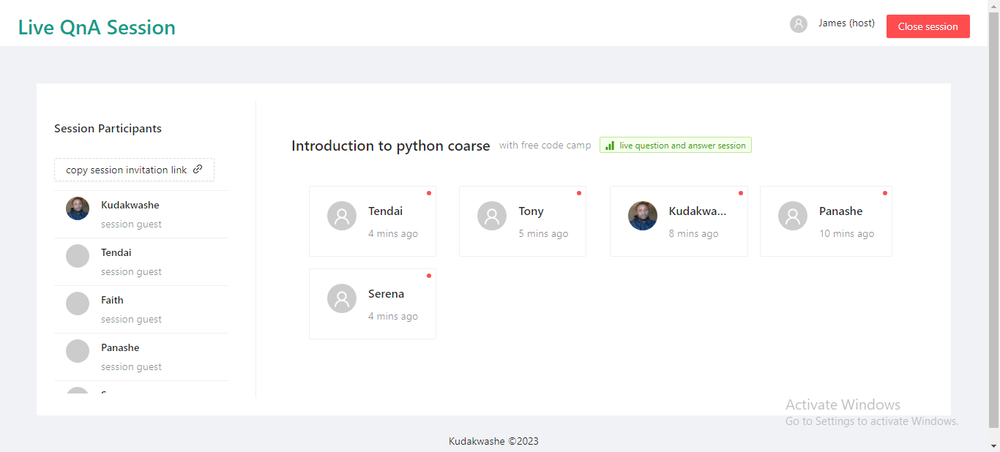

<p align="center">
  <a href="#Technoly">Technology Stack</a> &nbsp; | &nbsp;
  <a href="#getting-started">Getting Started</a> 
</p>
<h2 align="center">
  </br>Live QnA Session
</h2>
This a dashboard  spefically designed to answer live questions. The aim of this
dashboard is to provide separate interface that helps that helps tutors address questions more efficiently.
The dashboard offers a clearer and more structured format for displaying questions.
<p align="center">
   &nbsp; | &nbsp;
</p>

## Tech Stack
- Front-end  `Angular`  `Ant design ui system design`
- Backend `Python Fastapi`
- DB `Mongodb`
- Github workfow `python black`
- Host `Github Pages`

## Getting Started
1. Clone development branch :
    ```bash
    # Clone repository
 
  
    $ ls 
    ...
  TODO
